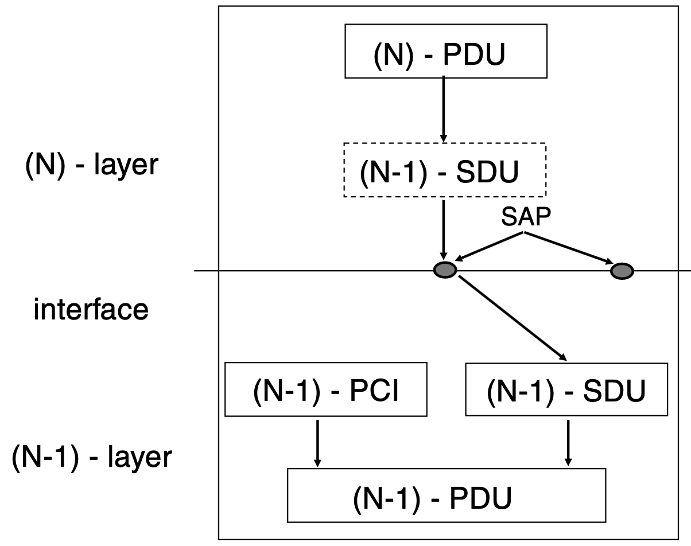
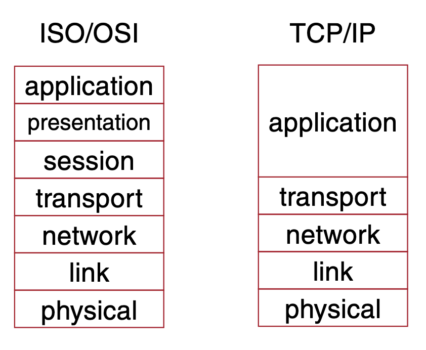
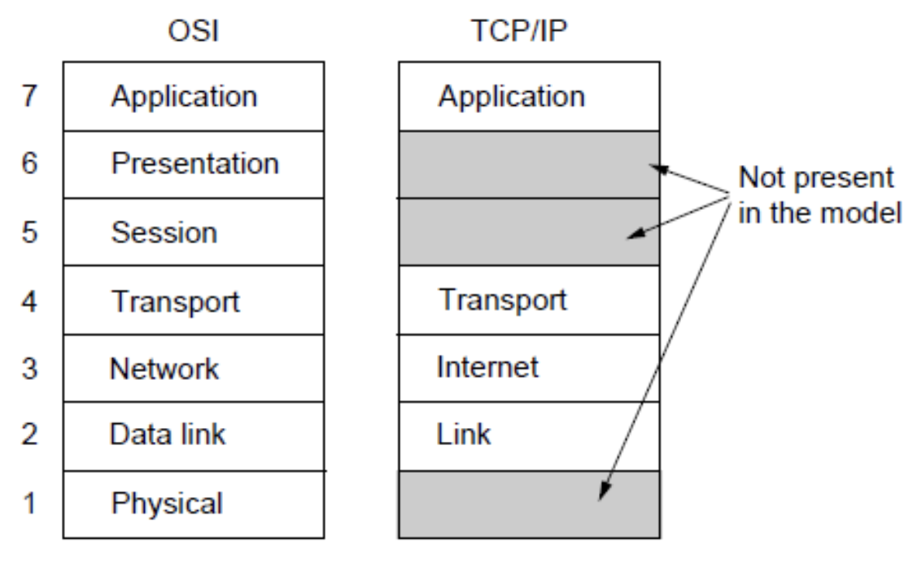
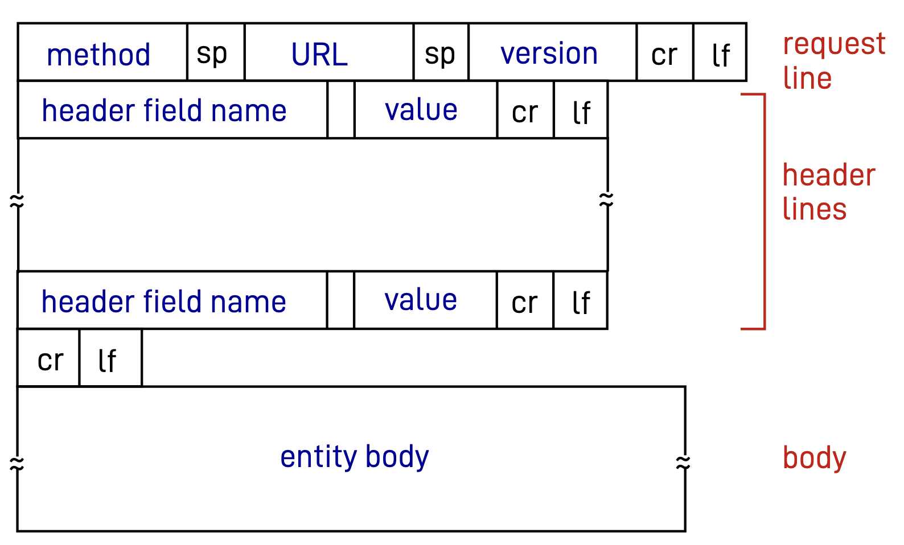
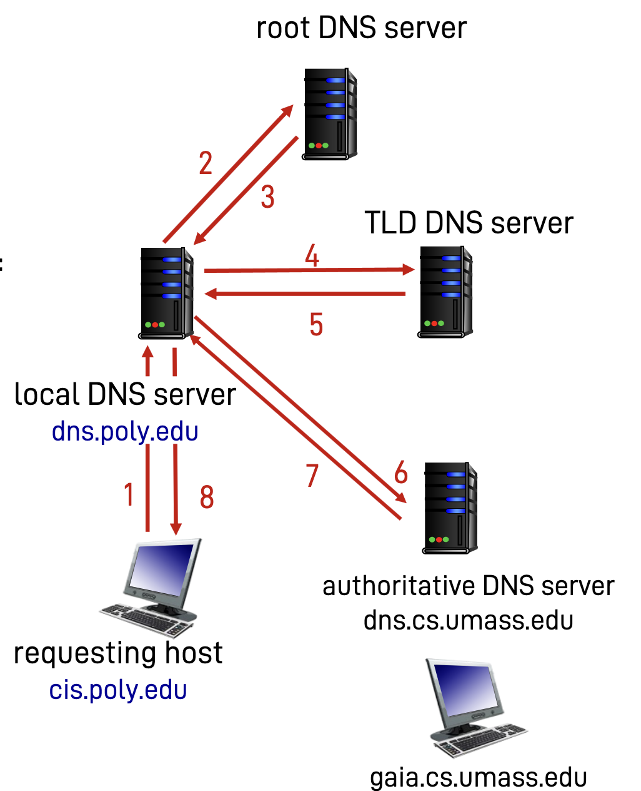

## Networking

### Protocols

Structure of protocol:

- Syntax
  - Format of the protocol messages
  - At low level: analog signals, currents, voltages
  - High level: fields with data
- Semantics
  - Meaning of messages
  - Behavior of the protocol
- Temporization
  - Time evolution of protocol (ex. time length of signal)
  - Timings (ex. timeout)

## Network structure

→ Edge: hosts (clients, servers) and servers in datacenters

→ Core: interconnected routers, network of networks

Interconnected by **access networks**: wired and wireless communication links

## Layering

Every layer provides services to the upper layer, by using the services of the lower layer and adding its own layers. The lower layers provide services to the upper layer using a programming interface called Service Access Point (SAP).

Each layer takes the data from the lower layer, puts them in its own Protocol Data Unit (PDU) and adds a header called Protocol Control Information.

From a theoretical point of view defined in the ISO/OSI standard, on of the possible implementations is TCP/IP.

### Implementation

Implementation of ISO/OSI prone to interpretation:

### ISO-OSI layers

#### Layer 1 - Physical

- Takes care of transmitting raw bits over the interface
  
  - Uses as medum electromagnetic radiation, electricity, light, sound

- Defines encoding, connectors, voltages, modulations

- Data units are bits or symbol

- Usually no addressing, everyone connected to the medium receives the message

#### Layer 2 - Link

- Single hop communication: connection between sender and receiver is direct, there are no intermediaries in between
- Corrects errors from layer 1
- LLC sublayer - multiplexing and demultiplexing, encapsulates data from the layer 3 and passes them to the layer 2
  - Ex. has information about which protocol of layer 3 to use to understand the message
- MAC sublayer - medium access control
  - Ex. people don't talk at the same time
  - MAC address: indentifies uniquely a device in the network
- Reliability

#### Layer 3 - Network

- Responsable of delivering network layer packets from one host to another
  
  - Routing and forwarding
  
  - Congestion control

- Can provide different services
  
  - Connection-less: each packet is routed independently
  
  - Connection-oriented: virtual circuit network
    
    - route is established once and used for whole communication
    
    - a circuit is established and a packet has as destination the circuit rather than a set of hosts

- Packets at layer 3 are called also datagrams

#### Layer 4 - Transport layer

- Responsabilities:
  
  - Quality of service problems of layer 3
  
  - Segmentation and reassempling of data
  
  - Application multiplexing and demultiplexing

- Main functions: flow control, error control, packet ordering

- Packets at layer 4 are called datagrams (non reliable service ex. UDP) or segments (reliable service ex. TCP)

#### Layer 5 - Session

- Setup and maintain a communication session between entities

- Thanks to this layer communication can be paused, restarted and terminated
  
  - Masks communication interruptions occurring at layer 4

- Often integrated in application

#### Layer 6 - Presentation

- Data representation and encoding (ex. ASCII, endianness - order of bytes)

- Encryption

#### Layer 7 - Application

- Provides the means to communicate and exchange data

- Example protocols: file transfer (FTP), virtual terminal (SSH), email (POP3, IMAP, SMTP), world wide web (HTTP)

### TCP/IP layers

#### Application layer

- Includes also session and presentation layer of ISO/OSI model

- End applications that users use

- Possible architecture types
  
  - Client - server
    
    - Server is fixed, always on and has permanent IP address
    
    - Clients communicate with the server, do not communicate with each other
    
    - Manual scalability: servers have to be added if there is an increase in demand
  
  - Peer to peer
    
    - Hosts arbitrary connect to each other anche change IP addresses
    
    - Self scalability: when hosts connect, the network automatically scales

- Sockets
  
  - Point of access for processes to communicate with each other

- Application layer defines:
  
  - Types of messages exchanged (request, response)
  
  - Message syntax (which fields in messages and how fields are delineated)
  
  - Semantics (meaning of information in field)
  
  - Rules for when and how processes send and respond to messages

- Procols can be open (ex. HTTP) or closed (ex. Skype)

- The lower layer (transport layer) has to provide the following features to the application layer:
  
  - Data integrity (some applications require 100% reliability, others don't)
  
  - Timing (some applications require low delay)
  
  - Throughput (some apps require fixed minimum throughput to function, other just use what's available ("elastic apps"))
  
  - Security (encryption, data integrity)

- HTTP
  
  - Application layer protocol
  
  - Stateless: server maintains no information about past client requests
  
  - Uses TCP
    
    - Non persistent HTTP:  initiate new TCP connection for every object
      
      - Issues: 2 RTT+ (Round trip time) for every object, OS overhead for each connection, browsers often open parallel TCP connections to fetch objects
    
    - Persistent HTTP: create TCP connection once and reuse it to download multiple objects
      
      - One RTT for each object
      - Server leaves connection open for subsequent requests
  
  - Request:
    
    - request line (GET, PUT, POST, DELETE, HEAD...), header lines, body
    
    - lines terminated by \r\n
      
      
  
  - Response
    
    - status line (200, 301, 400, 404, 505), header lines, data
  
  - Web caches: cache server between you and destination server
    
    - If object not in the cache server asks for the missing information to the true server and returns it back to the user
    
    - Benefits: reduces time for client request, reduce traffic on access network of organization (requests stay out of the network)
    
    - Condtional get:
      
      - set header If-modified-since
      
      - server sends data only if content has been updated after that date, otherwise return 304 Not Modified
  
  - Email
    
    - Components
    
    - User agent: reads and sends mail
      
      - Mail server:
        
        - Received mails are stored on the server
        
        - Holds queue of mails to send to other servers
        
        - Client: sender mail server, server: receiving mail server
    
    - Uses TCP to transfer mail from client to server
      
      - Port 25
      
      - 3 phases of tranfer: handshaking, transfer of messages, closure
  
  - DNS
    
    - Uses UDP
    
    - Root name server: 13 logical regions, have addresses of TLD DNS servers
    
    - DNS servers: responsible for top level domains (.com, .uk, .jp...)
    
    - Authoritative name servers: responsible for 2nd+ level (ex. google.com, disi.unitn.it, ciao.hello.sasso.dev)
      
      - Can be maintained by organization or provider
    
    - Local DNS server:
      
      - does not strictly belong to the hierarichy
      
      - run by ISPs, organizations...
      
      - Has local cache of name-address pairs, but they can be out of date
      
      - Acts as proxy, forwards query into hierarchy
      
      - 
    
    - DNS supports recursive requests (ask the root name server, if root doesn't have it it asks lower level servers and returns back the response)
      
      - Not used in practice, easily becomes DDOS attack to root servers
    
    - DNS caching: local name servers cache mapping, which disappear (expire) after some time (Time to live TTL), ex. TLD servers are almast aways caches
      
      DNS record: DNS servers store resource recors (RR)
      
      - Format: (name, value, type, TTL)
      
      - Type A: name -> hostname, value -> IP address
      
      - Type CNAME: name -> alias for real name, value -> canonical name (ex. www.ibm.com is server1.backup.ibm.com)
      
      - Type NS: name -> domain, value -> hostname of authoritative name server
      
      - Type MX: value -> address of mail server associated with name
    
    - DNS protocol messages encoded in binary
      
      - Identification of the query (since DNS uses UDP, makes sense for queries to have and ID so the answer can use the same ID)
      
      - Flags: query or reply, recursion desidered or recursion available, reply is authoritative
      
      - Length of questions, answers, authority (records of authoritative nameservers), additional helpful information
      
      - Every field can contain multiple Resource records (RR)
    
    - Inserting records into DNS
      
      - register name at DNS registrar: provide names, IP addresses of authoritative name server
      
      - registrar inserts two RRs into .com TLD server
        
        - networkutopia.com, dns1.networkutopia.com, NS
          dns1.networkutopia.com, 212.212.212.1, A
  
  
