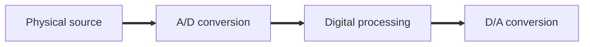
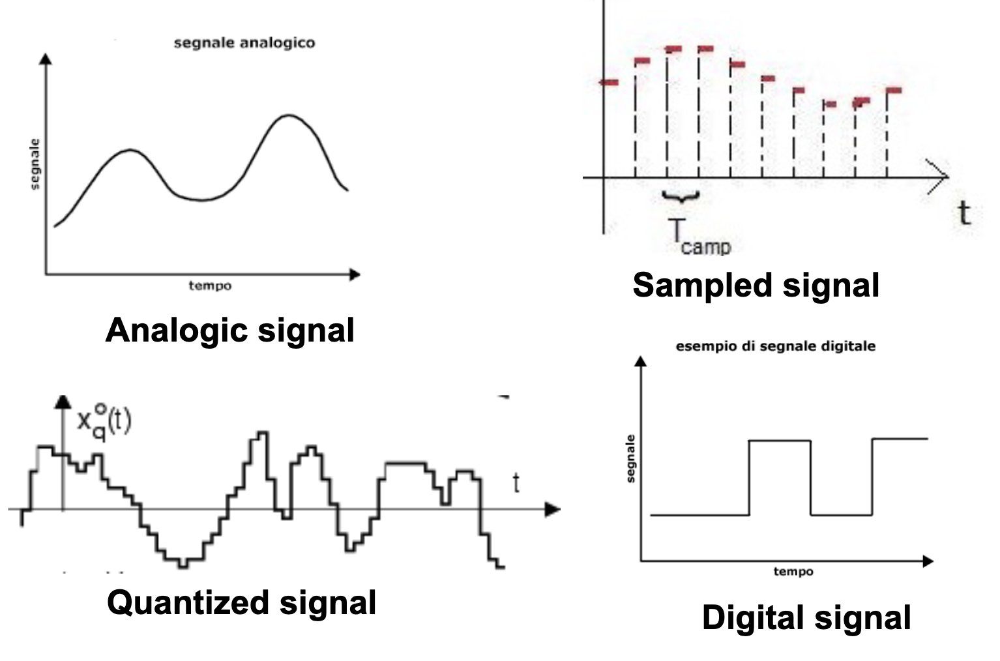
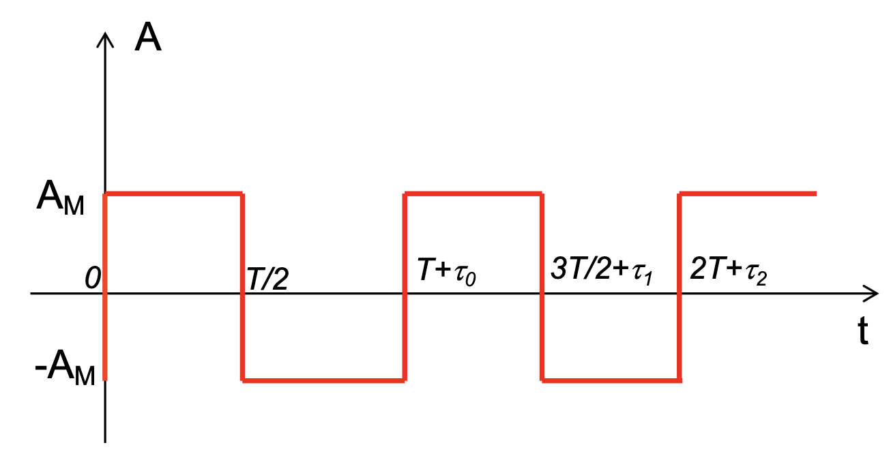

# Signal processing

## Signals

Signals are everything that convey information over some medium. A necessary condition for the signal to <u>carry information</u> is that it **changes** in the domain of reference and the variations shall <u>not</u> be predictable.

Apart from signal transmission also information memorization plays a key role in signal processing.

Types of signals:

- Light signals: EM radiations in range of visible wavelengths
  
  - Defined in space domain (x,y,z)
  
  - carry for ex. chape and color of objects

- Acustic signals: changes in pressure (mechanical vibrations)
  
  - Defined in temporal domain (t)
  
  - carry for ex. conversations, music

- Video signals:
  
  - Defined in both temporal and spatial domain

- Chemical signals:
  
  - carry for ex. flavors and tastes

Signal transducer: device that convert signal from a physical quantity to another (ex. eyes, ear, nose)

### Disturbance of signals

Noise: random disturbance of a signal

- ex. neon lights produce noise

Interference: disturbance due to other signal devices (sources)

- ex. smartphones produce EM radiations

- regulations mandate limits to EM radiations of electrical devices

Distortion: unwanted signal modifications due to non-idealities of physical systems

- Ex. ideal squared signals in the real world are not actually squared, but are slightly rounded

- Ex. length of trace introduces distortion

Due to the randomness of these disturbances they are delt with statistical tools.

## Signal processing

Generally more practical to convert signals into electric signals, because then we can process them with electrical devices (filters, amplifiers...).

Signal processing is usually done in the digital domain, because it is more practical and cost-effective.

### Types of signals

- Scalar signal
  
  - ex. electrocardiogram
  
  - real valued function in the time domain
  
  - $\mathbb{R} \to \mathbb{R}$

- Vectorial signal
  
  - Set of real valued functions in the time domain (real valued vectorial function in the time domain)
  
  - $\mathbb{R} \to \mathbb{R}^n$

- Multidimensional signal
  
  - B/W image
    
    - $\mathbb{R}^2 \to \mathbb{R}$ (xy to luminance)
  
  - Color image
    
    - $\mathbb{R}^2 \to \mathbb{R}^3$ (xy to RGB)
  
  - B/W frame sequence
    
    - Heterogeneous domain
    
    - $[\mathbb{R}^2 \times \mathbb{Z}] \to \mathbb{R}$ (xy times time (discrete) to luminance)

- Domain
  
  - Continuous domain signals: can be measured in any point of the domain -> domain is a real variable
  
  - Discrete domain signals: sequence of integer numbers

- Amplitude
  
  - Continuous amplitude signals: amplitude can assume all real values in an interval -> codomain is a real variable (also interval of real values has infinite cardinality)
  
  - Discrete amplitude signals: amplitude can assume values inside a countable set -> codomain may have not finite cardinality (interval of integers has finite cardinality, whole integer number set has infinite cardinality)

| Type              | Domain                                                                | Codomain                                                   | In math                                                                                                            | Examples                                                  |
| ----------------- |:---------------------------------------------------------------------:|:----------------------------------------------------------:| ------------------------------------------------------------------------------------------------------------------ | --------------------------------------------------------- |
| Analogic          | Continuous                                                            | Continuous                                                 | $\mathbb{R} \to \mathbb{R}$                                                                                        | Transducers (sensors) ex. temperature, microphone, camera |
| Sampled           | Discrete                                                              | Continuous                                                 |                                                                                                                    |                                                           |
| Quantized         | Continuous (domain can be infinite ex. time and there is no sampling) | Discrete                                                   |                                                                                                                    |                                                           |
| Digital/numerical | Discrete (sampled)                                                    | Finite cardinality discrete (amplitude cannot be infinite) | discontinuous function, keeps a value for a fixed amount of time (**signalling period**), inverse is **baud rate** | Obtained by analogic signals using A/D conversion         |

- Periodic signals
  
  - $x(t) = x(t+ kT), k \in \mathbb{Z}$
  
  - T is the **signal period**
  
  - can be also written as an infinite sum of the waveform w for all n: $\sum_{n=-inf}^{+inf}{w(t -nT)}, n \in \mathbb{Z}$
  
  - Represent natural cycling phenomena (ex. pendulum, oscillation, rhythm)

- Deterministic signals
  
  - Co-domain values are known a-priori
  
  - Can be represented by an analytical function
  
  - Stable-clock signal (known period and amplitude)

- Random signals
  
  - Co-domain values can only be observed a-posteriori
  
  - Signals produced by the real physical phenomena
  
  - Treated with statistical tools (random processes)
  
  - Audio signal produced by a microphone, thermal noise
  
  - Clock with unstable frequency -> the values at certain time t cannot be known a-priori
  
  - - tau is called jitter - realization of random variable

